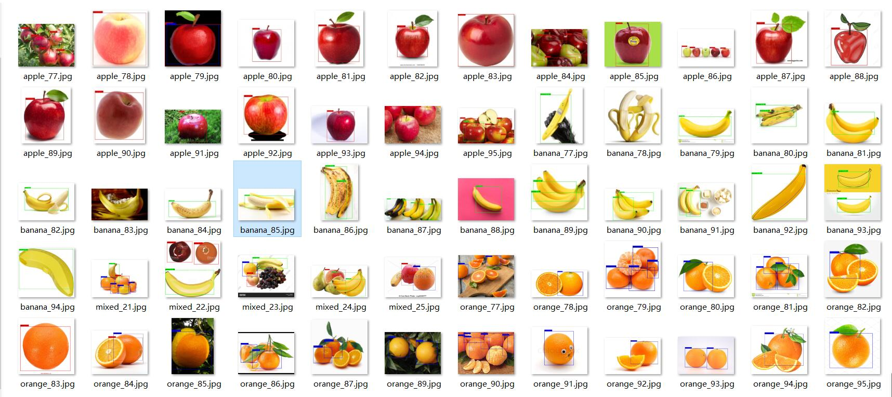
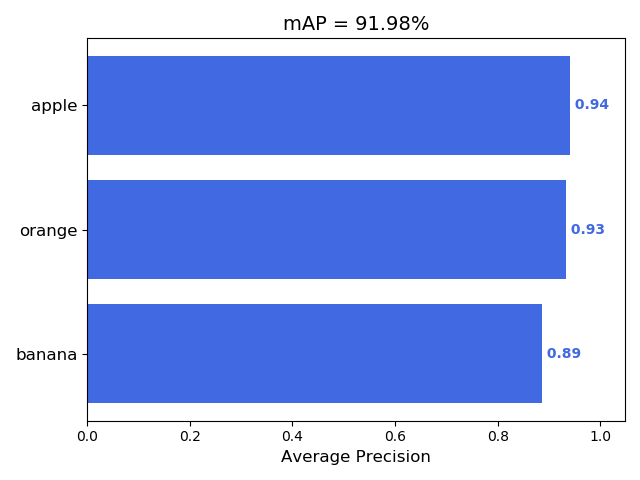

# 水果识别小程序算法
用于部署的水果识别小程序算法

**(如果你使用git下载总是报红，你可以选择下载dev-sidecar编程软件加速下载--https://gitee.com/interesting-goods/dev-sidecar?_from=gitee_search)**

## 权重下载
下载百度网盘权重文件（链接：https://pan.baidu.com/s/15gn0Q3yNLea-n_romMUMDg 提取码：8m7g）放在model_data目录下

## 展示

